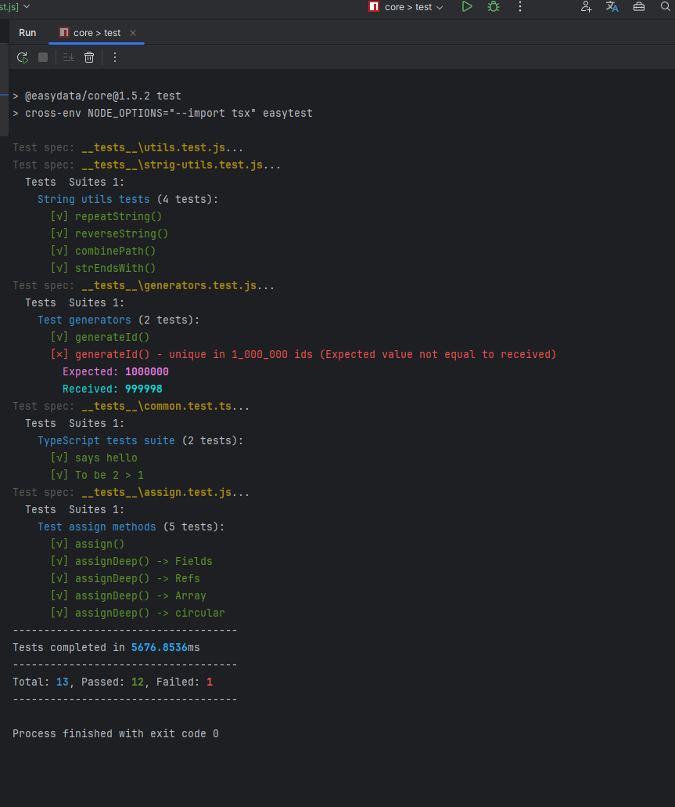

# EasyTest

Simple testing framework for JS, TS. 
Written in pure JavaScript. 
JavaScript and TypeScript tests. 
There is support for asynchronous code testing and TypeScript testing out of the box.
Global DOM object for testing out of the box.

---

[](https://www.npmjs.com/package/@olton/easytest)
[](https://opensource.org/licenses/MIT)

---



---

## Installation

```bash
npm install @olton/easytest -D
```

## Usage

To use `EasyTest` you don't need to import `it`, `test` or `describe` in your test file.
But you must return value from `it` or `test` function.


Create test file with `*.test.js` extension.
```javascript
function hello() {
    return "Hello"
}

describe(`Common tests suite`, () => {
    it(`says hello`, () => {
        return expect(hello()).toBe("Hello")
    })
})

test(`Bad test 2 !== 1`, () => {
    return expect(2).toBe(1)
})

```

### Async tests
```javascript
async function fetchData() {
    return new Promise((resolve) => {
        setTimeout(() => {
            resolve("Data received");
        }, 1000);
    });
}

describe('Async function tests', async () => {
    it('should return data after 1 second', async () => {
        const data = await fetchData();
        return expect(data).toBe("Bad Data");
    });
});
```

Update `package.json` to run tests with `easytest` command.
```json
{
    "scripts": {
        "test": "easytest"
    }
}
```

### Functions
- `describe` - create test suite
- `it` - create test case
- `expect` - create assertion
- `beforeEach` - run before each test case
- `afterEach` - run after each test case
- `beforeAll` - run before all test cases
- `afterAll` - run after all test cases
- `test` - create simple test
- `DOM` - create DOM object (not global)

### Matchers
- [x] `toBe` - compare values with `===`
- [x] `toBeNot` - compare values with `!==`
- [x] `toBeEqual` - compare values with `==`
- [x] `toBeNotEqual` - compare values with `!=`
- [x] `toBeMatch` - compare strings with regex
- [x] `toBeDefained` - check if value is defined
- [x] `toBeUndefined` - check if value is undefined
- [x] `toThrow` - check if function throws an error
- [x] `toThrowError` - check if function throws an error with a specific message
- [x] `toBeGreaterThan` - check if value is greater than
- [x] `toBeGreaterThanOrEqual` - check if value is greater than
- [x] `toBeLessThan` - check if value is less than
- [x] `toBeLessThanOrEqual` - check if value is less than
- [x] `toBeNull` - check if value is null
- [x] `toBeNotNull` - check if value is not null
- [x] `toBeTruthy` - check if value is true
- [x] `toBeFalsy` - check if value is false
- [x] `toContain` - check if an array contains value or string contains substring
- [x] `toBeArrayEqual` - check if arrays are equal
- [x] `toBeIP` - check if string is IPv4 address
- [x] `toBeIPv4` - check if string is IPv4 address
- [x] `toBeIPv6` - check if string is IPv6 address
- [x] `toBeEmail` - check if string is email address
- [x] `toBeUrl` - check if string is url address
- [x] `toBeBetween` - check if value between two values
- [x] `toBeType` - check if value is of a specific type
- [x] `toBeInstanceOf` - check if value is instance of a specific class
- [x] `toBeEmpty` - check if value is empty
- [x] `toBeNotEmpty` - check if value is not empty
- [x] `toBeSorted` - check if array is sorted
- [x] `toBeUnique` - check if array has unique values
- [x] `toStructureEqual` - check if object has a structure
- [x] `toBeDeepEqual` - check if objects are deeply equal
- [x] `toBeEqualObject` - check if two simple objects are equal, to deep compare use `toBeDeepEqual`

### TypeScript
To use `EasyTest` with TypeScript you need to install `tsx` package.
```bash
npm install tsx -D
```
and then 
```json
{
    "scripts": {
        "test": "cross-env NODE_OPTIONS=\"--import tsx\" easytest"
    }
}
```

### cross-env
Run scripts that set and use environment variables across platforms.
```bash
npm install --save-dev cross-env
```

### Environment variables to support TypeScript

**powershell**
```powershell
$env:NODE_OPTIONS="--import tsx"
```

**linux**, **macos**
```bash
export NODE_OPTIONS="--import tsx"
```

**cmd**
```cmd
set NODE_OPTIONS="--import tsx"
```

## License
EasyTest licensed under MIT license.

## Contributing

### Bug Reports & Feature Requests
Use issue tracker to report bugs or request new features.

---
### Copyright
© 2024 Serhii Pimenov. All rights reserved.
