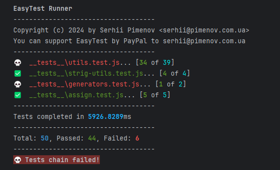
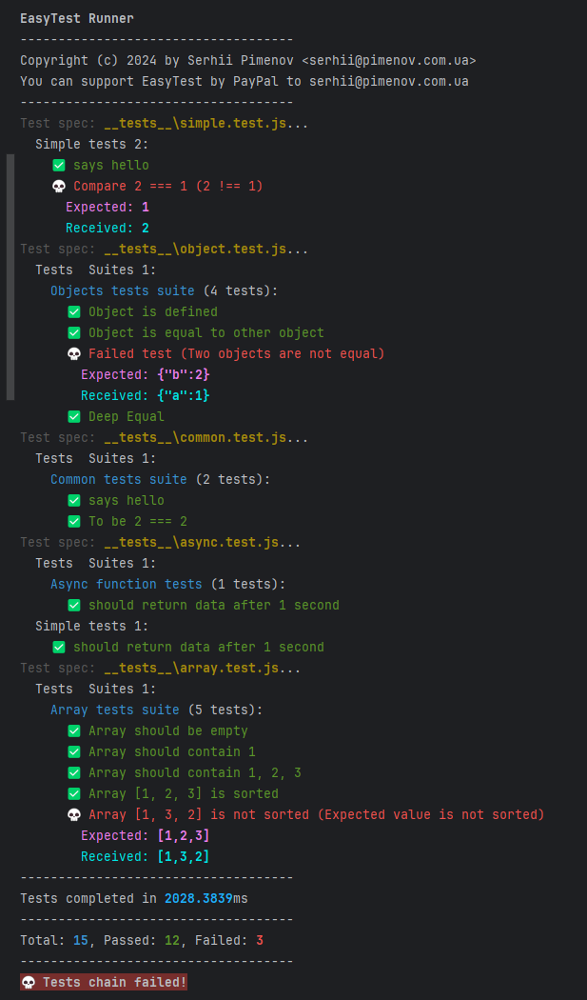
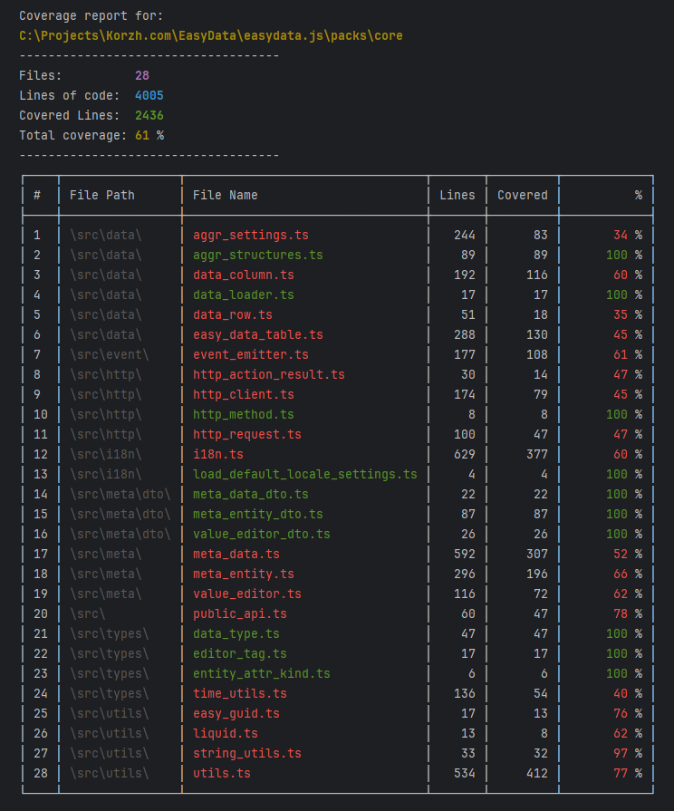

# EasyTest

Simple testing framework for JS, TS, written in pure JavaScript.

Core features:
- No need to import `it`, `test`, `describe` or `ecpext` in your test file. These functions are available globally.
- You can use both `js` and `ts` test files in the same project.
- Asynchronous code testing.
- TypeScript testing out of the box.
- Global DOM object for testing HTML objects.
- Built-in coverage tool.
- Verbose or non verbose mode.
- Mock functions.
- Big set of built-in matchers.
- Extend `expect` function with your own matchers.
- Compatible with `codecov` report viewer.
- A lot of expects in one test case.
- Setup and Teardown functions (`beforeEach`, `afterEach`, `beforeAll`, `afterAll`).
---

Support for PayPal to **serhii@pimenov.com.ua**

---

[](https://www.npmjs.com/package/@olton/easytest)
[](https://opensource.org/licenses/MIT)
[](https://codecov.io/gh/olton/easytest)


---



---

## Installation

```bash
npm install @olton/easytest -D
```

## Usage

To use `EasyTest` you don't need to import `it`, `test` or `describe` in your test file.
Create a test file with `*.test.js` or `*.test.ts` extension (for example).
You can use both of them in the same project.

```javascript
function hello() {
    return "Hello"
}

describe(`Common tests suite`, () => {
    it(`says hello`, () => {
        return expect(hello()).toBe("Hello")
    })
})

test(`Bad test 2 !== 1`, () => {
    return expect(2).toBe(1)
})

```

### Async tests
```javascript
async function fetchData() {
    return new Promise((resolve) => {
        setTimeout(() => {
            resolve("Data received");
        }, 1000);
    });
}

describe('Async function tests', async () => {
    it('should return data after 1 second', async () => {
        const data = await fetchData();
        return expect(data).toBe("Bad Data");
    });
});
```

Update `package.json` to run tests with `easytest` command.
```json
{
    "scripts": {
        "test": "easytest"
    }
}
```

### Functions
- `describe` - create test suite
- `it` - create a test case
- `expect` - create assertion
- `beforeEach` - run before each test case
- `afterEach` - run after each test case
- `beforeAll` - run before all test cases
- `afterAll` - run after all test cases
- `test` - create simple test
- `mocker` - create mock function
- `DOM` - create DOM object (not global)

### Matchers
EasyTest contains a big set of built-in matchers.

- `toBe(expected, msg?: string)` - Asserts that the actual value is equal to the expected value.
- `toBeNot(expected, msg?: string)` - Asserts that the actual value is not equal to the expected value.
- `toBeStrictEqual(expected, msg?: string)` - Asserts that the actual value is strict equal (using ===) to the expected value.
- `toBeNotStrictEqual(expected, msg?: string)` - Asserts that the actual value isn't strict equal (using !==) to the expected value.
- `toBeEqual(expected, msg?: string)` - Asserts that the actual value is equal (using ==) to the expected value.
- `toBeNotEqual(expected, msg?: string)` - Asserts that the actual value is not equal (using !=) to the expected value.
- `toBeObject(expected, msg?: string)` - Asserts that the actual object is equal to the expected object.
- `toBeTrue(msg?: string)` - Asserts that the actual value is true.
- `toBeFalse(msg?: string)` - Asserts that the actual value is false.
- `toBeBoolean(msg?: string)` - Asserts that the actual value is a boolean.
- `toMatch(expected, msg?: string)` - Asserts that the actual value matches the expected pattern.
- `toNotMatch(expected, msg?: string)` - Asserts that the actual value not matches the expected pattern.
- `toBeDefined(msg?: string)` - Asserts that the actual value is defined.
- `toBeUndefined(msg?: string)` - Asserts that the actual value is undefined.
- `toBeNull(msg?: string)` - Asserts that the actual value is null.
- `toBeNotNull(msg?: string)` - Asserts that the actual value is not null.
- `toBeGreaterThan(expected, msg?: string)` - Asserts that the actual value is greater than the expected value.
- `toBeGreaterThanOrEqual(expected, msg?: string)` - Asserts that the actual value is greater than or equal to the expected value.
- `toBeLessThan(expected, msg?: string)` - Asserts that the actual value is less than the expected value.
- `toBeLessThanOrEqual(expected, msg?: string)` - Asserts that the actual value is less than or equal to the expected value.
- `toBetween(min, max, msg?: string)` - Asserts that the actual value is between the specified minimum and maximum values.
- `toBeInteger(msg?: string)` - Asserts that the actual value is an integer.
- `toBeNotInteger(msg?: string)` - Asserts that the actual value is an integer.
- `toBeSafeInteger(msg?: string)` - Asserts that the actual value is a safe integer.
- `toBeNotSafeInteger(msg?: string)` - Asserts that the actual value is a safe integer.
- `toBeFloat(msg?: string)` - Asserts that the actual value is a float.
- `toBePositive(msg?: string)` - Asserts that the actual value is positive.
- `toBeNegative(msg?: string)` - Asserts that the actual value is negative.
- `toBeFinite(msg?: string)` - Asserts that the actual value is finite.
- `toBeNumber(msg?: string)` - Asserts that the actual value is a number and not is NaN.
- `toBeNaN(msg?: string)` - Asserts that the actual value is NaN.
- `toBeCloseTo(expected, precision = 2, msg?: string)` - Asserts that the actual value is close to the expected value within a certain precision.
- `toThrow(msg?: string)` - Asserts that the actual function throws an error.
- `toThrowError(expected, msg?: string)` - Asserts that the actual function throws an error matching the expected value.
- `toBeHEXColor(msg?: string)` - Asserts that the actual value is a HEX color.
- `toBeRGBColor(msg?: string)` - Asserts that the actual value is an RGB color.
- `toBeRGBAColor(msg?: string)` - Asserts that the actual value is an RGBA color.
- `toBeHSVColor(msg?: string)` - Asserts that the actual value is an HSL color.
- `toBeHSLColor(msg?: string)` - Asserts that the actual value is an HSL color.
- `toBeHSLAColor(msg?: string)` - Asserts that the actual value is an HSLA color.
- `toBeCMYKColor(msg?: string)` - Asserts that the actual value is a CMYK color.
- `toBeColor(msg?: string)` - Asserts that the actual value is a valid color (HEX, RGB, RGBA, HSV, HSL, HSLA, or CMYK).
- `toBeNotColor(msg?: string)` - Asserts that the actual value is not a valid color (HEX, RGB, RGBA, HSV, HSL, HSLA, or CMYK).
- `toHaveBeenCalled(msg?: string)` - Asserts the mock function was called at least once
- `toHaveBeenCalledTimes(expected, msg?: string)` - Asserts the mock function was called at least once
- `toHaveBeenCalledWith(expected, msg?: string)` - Asserts that the mock function was called with specified arguments.
- `toHaveBeenLastCalledWith(expected, msg?: string)` - Asserts that the mock function was called last with specified arguments.
- `toContain(expected, msg?: string)` - Asserts that the actual value contains the expected value.
- `toNotContain(expected, msg?: string)` - Asserts that the actual value not contains the expected value.
- `toBeDeepEqual(expected, msg?: string)` - Asserts that the actual value is deeply equal to the expected value.
- `toBeDeepEqualSafe(expected, msg?: string)` - Asserts that the actual value is deeply equal to the expected value using a safe comparison.
- `toBeObjectStructureEqual(expected, msg?: string)` - Asserts that the actual structure is equal to the expected structure.
- `toBeArrayEqual(expected, msg?: string)` - Asserts that the actual array is equal to the expected array.
- `toBeArray(msg?: string)` - Asserts that the actual value is an array.
- `toBeArraySorted(msg?: string)` - Asserts that the actual value is sorted.
- `toBeArrayNotSorted(msg?: string)` - Asserts that the actual value is not sorted.
- `toBeArrayUnique(msg?: string)` - Asserts that values in the array are unique.
- `toBeArrayNotUnique(msg?: string)` - Asserts that values in the array are not unique.
- `toBeIP(msg?: string)` - Asserts that the actual value is a valid IP address.
- `toBeNotIP(msg?: string)` - Asserts that the actual value isn't a valid IP address.
- `toBeIPv4(msg?: string)` - Asserts that the actual value is a valid IPv4 address.
- `toBeIPv6(msg?: string)` - Asserts that the actual value is a valid IPv6 address.
- `toBeEmail(msg?: string)` - Asserts that the actual value is a valid email address.
- `toBeUrl(msg?: string)` - Asserts that the actual value is a valid URL.
- `toBeEmpty(msg?: string)` - Asserts that the actual value is empty.
- `toBeNotEmpty(msg?: string)` - Asserts that the actual value is not empty.
- `hasLength(expected, msg?: string)` - Asserts that the array-like object has the expected length.
- `toBeBase64(msg?: string)` - Asserts that the actual value is a Base64 encoded string.
- `toBeJson(msg?: string)` - Asserts that the actual value is a JSON string.
- `toBeXml(msg?: string)` - Asserts that the actual value is an XML string.
- `hasProperty(expected, msg?: string)` - Asserts that the actual value has the specified property.
- `hasNoProperty(expected, msg?: string)` - Asserts that the actual value has not the specified property.
- `toBeType(type, msg?: string)` - Asserts that the actual value is of the specified type.
- `toBeInstanceOf(type, msg?: string)` - Asserts that the actual value is an instance of the specified type.
- `toBeString(msg?: string)` - Asserts that the actual value is a string.
- `toBeFunction(msg?: string)` - Asserts that the actual value is a function.
- `toBeAsyncFunction(msg?: string)` - Asserts that the actual value is an async function.
- `toBeDate(msg?: string)` - Asserts that the actual value is a date.
- `toBeDateObject(msg?: string)` - Asserts that the actual value is a date.
- `toBeRegExp(msg?: string)` - Asserts that the actual value is a regular expression.
- `toBeSymbol(msg?: string)` - Asserts that the actual value is a symbol.
- `toBeBigInt(msg?: string)` - Asserts that the actual value is a BigInt.
- `toBeMap(msg?: string)` - Asserts that the actual value is a Map.
- `toBeSet(msg?: string)` - Asserts that the actual value is a Set.
- `toBeWeakMap(msg?: string)` - Asserts that the actual value is a WeakMap.
- `toBeWeakSet(msg?: string)` - Asserts that the actual value is a WeakSet.
- `toBeArrayBuffer(msg?: string)` - Asserts that the actual value is an ArrayBuffer.
- `toBePromise(msg?: string)` - Asserts that the actual value is a Promise.
- `toBeHtmlElement(msg?: string)` - Asserts that the actual value is an HTML element.
- `toBeNode(msg?: string)` - Asserts that the actual value is an HTML node.
- `toBeDocument(msg?: string)` - Asserts that the actual value is an HTML document.
- `toBeHtmlCollection(msg?: string)` - Asserts that the actual value is an HTML collection.
- `toBeWindow(msg?: string)` - Asserts that the actual value is a Window object.
- `toBeTextNode(msg?: string)` - Asserts that the actual value is a Text node.
- `hasClass(expected, msg?: string)` - Asserts that the HTML element has the specified class.
- `hasNoClass(expected, msg?: string)` - Asserts that the HTML element has the specified class.
- `hasAttribute(expected, msg?: string)` - Asserts that the HTML element has the specified attribute.
- `hasNoAttribute(expected, msg?: string)` - Asserts that the HTML element has the specified attribute.
- `hasChildren(msg?: string)` - Asserts that the HTML element has children.
- `hasNoChildren(msg?: string)` - Asserts that the HTML element has children.
- `hasParent(msg?: string)` - Asserts that the HTML element has a parent.
- `hasNoParent(msg?: string)` - Asserts that the HTML element has no parent.


### TypeScript
To use `EasyTest` with TypeScript you need to install `tsx` package.
```bash
npm install tsx -D
```
and then 
```json
{
    "scripts": {
        "test": "cross-env NODE_OPTIONS=\"--import tsx\" easytest"
    }
}
```

### cross-env
Run scripts that set and use environment variables across platforms.
```bash
npm install --save-dev cross-env
```

### Environment variables to support TypeScript

**powershell**
```powershell
$env:NODE_OPTIONS="--import tsx"
```

**linux**, **macos**
```bash
export NODE_OPTIONS="--import tsx"
```

**cmd**
```cmd
set NODE_OPTIONS="--import tsx"
```

## Configuration
To configure `EasyTest` you need to create a `easytest.config.json` file in the root of your project.
Also, you can use argument `--config fileName` to specify a configuration file.

```json
{
    "scripts": {
        "test": "easytest --config myconfig.json"
    }
}
```

**The default values are:**
```json
{
  "include": ["**/*.spec.{t,j}s", "**/*.spec.{t,j}sx", "**/*.test.{t,j}s", "**/*.test.{t,j}sx"],
  "exclude": ["node_modules/**"],
  "coverage": false,
  "verbose": false,
  "report": {
    "type": "lcov",
    "dir": "coverage"
  }
}
```

### Verbose
In verbose mode, you will see the detailed results in the console.



To enable `verbose` mode, set parameter **verbose** to **true** in config file or use argument `--verbose`.

```json
{
    "scripts": {
        "test": "easytest --verbose"
    }
}
```

## Coverage

EasyTest has a built-in coverage tool.



To enable `coverage`, set parameter **coverage** to **true** in config file or use argument `--coverage`.

```json
{
    "scripts": {
        "test": "easytest --coverage"
    }
}
```

## Include tests
You can specify the files to include in the test run.

```json
{
    "include": ["**/*.spec.{t,j}s", "**/*.spec.{t,j}sx", "**/*.test.{t,j}s", "**/*.test.{t,j}sx"]
}
```

or use argument `--include`.

```json
{
    "scripts": {
        "test": "easytest --include='**/common.test.js,**/common.spec.js'"
    }
}
```

## Exclude files
You can specify the files to exclude from the test run.

```json
{
    "exclude": ["node_modules/**"]
}
```

or use argument `--exclude`.

```json
{
    "scripts": {
        "test": "easytest --exclude='node_modules/**,dist/**'"
    }
}
```

## Executing tests by name
You can run a specific test by name using the `--test` argument.

```json
{
    "scripts": {
        "test": "easytest --test='Compare with 2'"
    }
}
```
In this case only the test with the name includes `Compare with 2` will be executed.

## Extend expect
You can extend the `expect` function with your own matchers.

```javascript
import {Expect} from "../src/expect.js";

class MyExpect extends Expect {
    toBeEven() {
        let received = this.received
        let result = received % 2 === 0
        if (!result) {
            this.message = `Expected ${received} to be even`
        }
    }
}

const expect = (received) => new MyExpect(received)

test(`Custom expect`, () => {
    expect(2).toBeEven()
})
```

### Example UI Testing
You can use `EasyTest` to test UI components. In this example, I test the Metro UI accordion component.
```javascript
import fs from "fs";
import {beforeAll, describe, it, expect} from "@olton/easytest";

beforeAll(() => {
    window.METRO_DISABLE_BANNER = true;
    window.METRO_DISABLE_LIB_INFO = true;
    document.body.innerHTML = `
    <div id="accordion">
        <div class="frame">
            <div class="heading">Heading</div>
            <div class="content">Content</div>
        </div>
    </div>
`

    window.eval(fs.readFileSync('./lib/metro.js', 'utf8'))
})

describe(`Accordion tests`, () => {
    it(`Create accordion`, async () => {
        const accordion = window.Metro.makePlugin("#accordion", 'accordion')[0]
        expect(accordion).hasClass('accordion')
    })
})
```

## License
EasyTest licensed under MIT license.

## Contributing

### Bug Reports & Feature Requests
Use issue tracker to report bugs or request new features.

---
### Copyright
© 2024 Serhii Pimenov. All rights reserved.
